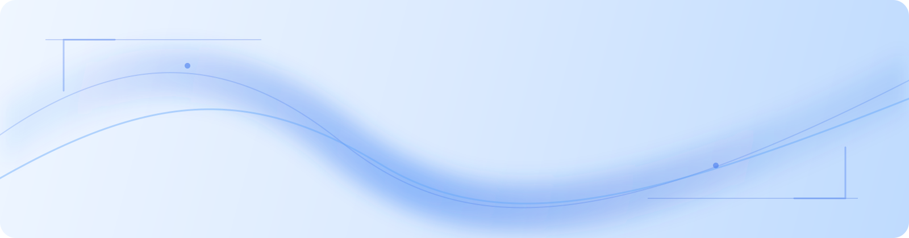

<div align="center">
  
</div>

<table width="100%">
  <tr>
    <td align="left" valign="top">
      <h1 style="color:#1d4ed8;">衎衎</h1>
    </td>
    <td align="right" valign="top">
      <h3>你好，欢迎来到我的主页</h3>
      <p>Keep exploring. Keep building.</p>
    </td>
  </tr>
</table>

<p align="center">
  
  
  
</p>

<br />

## About

这里可以放一段你自己的介绍。可以写你正在学习的方向、喜欢解决的问题，或者一句你想留在主页上的话。

## Interests

<table>
  <tr>
    <td>AI 应用</td>
    <td>工程实践</td>
    <td>知识探索</td>
  </tr>
</table>

## Tech Notes

```text
Python · FastAPI · LangGraph · RAG · Docker · Linux
```

## Projects

<!-- 在这里添加你的项目链接，例如：
- [项目名称](项目链接) - 一句话介绍
-->

## Currently

正在持续整理想法、尝试新的工具，并把有趣的东西做成可以使用的作品。

<p align="center">
  <sub>Thanks for stopping by.</sub>
</p>
